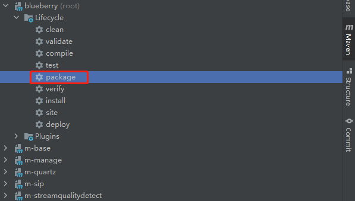
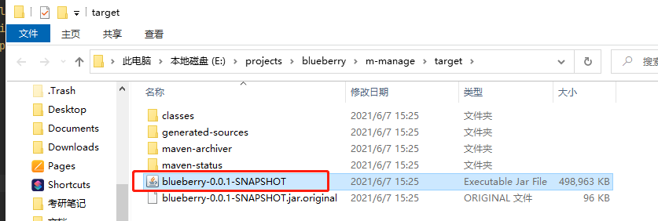

# 1 ZLMediaKit 安装

## 1.1 windows

### 1.1.1 安装依赖库

#### 1.1.1.1 ffmpeg

1. [官网下载](https://ffmpeg.en.softonic.com/download)或者[网盘下载（提取码：1234）](https://pan.baidu.com/s/1CoF6KzcB2oETtXsWK7gE-g)项目中提供的安装程序。
2. 解压安装文件，配置环境变量，指向ffmpeg.exe所在目录。

### 1.1.2 安装 ZLMediaKit

1. 可拉取ZLMediaKit[源代码](https://github.com/ZLMediaKit/ZLMediaKit)进行构建，参考[官方构建指南](https://github.com/ZLMediaKit/ZLMediaKit/wiki/%E5%BF%AB%E9%80%9F%E5%BC%80%E5%A7%8B)。
2. 也可[网盘下载（提取码：1234）](https://pan.baidu.com/s/1-BF6f5e3TbH1whuwclNsCA)已构建好的可执行程序。

### 1.1.3 启动 ZLMediaKit

1. 如果使用1.1.2中1方式构建安装，进入ZLMediaKit构建目录，运行 **release/windows/Debug** 目录下的可执行程序 **MediaServer.exe**
2. 如果使用1.1.2中2方式，解压已构建好的程序，执行解压目录下的可执行程序 **MediaServer.exe**

# 2 数据库安装
1. 安装mysql数据库（推荐5.7版本）
2. 创建blueberry数据库，执行blueberry项目中database目录下 blueberry.sql 进行数据库表初始化

# 3 Blueberry 部署

1. 更新项目代码。

2. 进入项目目录，执行maven命令进行打包。

   

3. 打包完成后，在 **m-manage/target** 目录下可找到jar文件。

   

4. 运行jar包。
